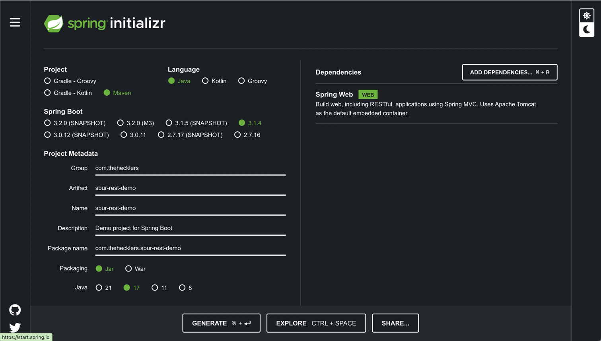

# Springboot

# 1. 스프링 부트
## 1-1. 스프링 부트의 핵심 기능
- 의존성 관리(Dependency Management) 간소화 
- 배포(Deployment) 간소화
- 자동 설정(Auto Configuration)

 
 
 

# 2. 도구 선택 및 시작
## 2-1. 메이븐 vs 그레이들
자바 애플리케이션 빌드 도구 메이븐과 그레이들

### 아파치 메이븐
엄격하고 독단적인 선언적 접근법으로 프로젝트와 개발 환경을 대단하 일관되게 만든다.  
하지만 메이븐 방식을 따르면 문제가 거의 발생하지 않아서 빌드에 신경쓰지 않고 코드에만 집중할 수 있다.

### 그레이들
그레이들은 최소한의 코드로 유연한 빌드 파일 build.gradle을 생성한다. 따라서 간단한 프로젝트와 매우 복잡한 프로젝트에서 유용하다. 또한 대규모 프로젝트에서는 메이븐 보다 빌드 속도가 훨씬 빠르다. 
그러나 그레이들로 빌드한 프로젝트는 그 유연함 때문에 프로젝트가 예상대로 작동하지 않을 수 있다. 또한 새로 출시된 버전의 프로그래밍 언어를 사용하면 종종 문제가 생긴다.

 

## 2-2. 자바 vs 코틀린
JVM에서 사용 가능한 언어는 많지만 그중 가장 널리 사용하는 자바와 코틀린 

### 자바 
자바는 25년 이상된 프로그래밍 언어이며 지속적으로 발전하고 있는 언어이다. 오랜 역사만큼 풍부한 예제 코드와 샘플 프로젝트를 참고할 수 있다.

### 코틀린
코틀린은 자바의 사용성을 개선하기 위해 만든 떠오르는 샛별이다.
- 간결함 : 컴파일러와 다른 개발자에게 최소한의 코드로 의도를 명확하게 전달
- 안전성 : null 관련 오류 제거 
- 상호 운용성 : 기존의 모든 JVM, 안드로이드, 브라우저 라이브러리와 호환
- 도구 친화적 : 수많은 IDE 또는 자바처럼 명령 줄로 코틀린 애플리케이션 빌드  

간결함 덕분에 코틀린으로 작성된 스프링 부트 애플리케이션은 자바로 만들어진 것보다 더 짧고 읽기 쉬우면서도 의도 전달력은 그대로 유지된다.

 

## 2-3. 스프링 이니셜라이져
## [이니셜라이져](https://start.spring.io)

 

## 2-4. 스프링 부트 CLI

### SDK 설치
    % curl -s "https://get.sdkman.io" | bash
    % source "$HOME/.sdkman/bin/sdkman-init.sh"

    % sdk version                       // 설치 확인
    % sdk list java                     // 설치할 수 있는 자바 목록 보기
    % sdk install java 11.0.19-amzn     // 리스트로 확인한 것 중 다운받을 버전 넣기
    % sdk use java 11.0.19-amzn        // 사용하기
    % sdk current java                 // 현재 사용 버전 확인
    % echo $JAVA_HOME                  // 환경변수 자동 설정 확인

### 스프링 부트 프로젝트 시작하기

    % sdk install springboot           // 스프링 부트 설치

    % spring init                      // default 값으로 프로젝트 시작 
    % unzip demo.zip -d demo            

    % spring init -a demo -l java --build maven demo    // 설정 값으로 프로젝트 시작
        -a demo : 프로젝트의 아티팩트 ID 설정
        -l java : 프로젝트 기본 언어 (java, kotlin, groovy)
        --build : 빌드 시스템 (maven, gradle)
        -x demo : 이니셜라이저로 만든 프로젝트의 .zip 파일을 'demo' 디렉터리에 압축해제

        --target https://스프링 부트-프로젝트-생성에-사용할-url

 
 
 

# 3. REST API
## 3-1. API, HTTP 메서드 스타일
- POST 생성
- GET 조회
- PUT 수정
- PATCH 수정
- DELETE 삭제

### 스프링 MVC를 사용한 애플리케이션 만들기

### 간단한 도메인 만들기

    @SpringBootApplication
    public class SburRestDemoApplication {
    
        public static void main(String[] args) {
    
            SpringApplication.run(SburRestDemoApplication.class, args);
    
        }
    
    }
    
    class Coffee {
    private final String id;    // final 선언으로 한 번 할당하면 수정 불가
    private String name;
    
        public Coffee(String id, String name) {
            this.id = id;
            this.name = name;
        }
    
        public Coffee(String name) {
            this(UUID.randomUUID().toString(), name);
        }
    
        public String getId() {
            return id;
        }
    
        public String getName() {
            return name;
        }
    
        public void setName(String name) {
            this.name = name;
        }
    }

 

## 3-2. GET으로 시작하기

### @RestController 개요

 

## 3-3. 믿으라, 그러나 검증하라

 
 
 

# 4. 데이터베이스 액세스
## 4-1. DB 엑세스를 위한 자동 설정 프라이밍

 

## 4-2. 앞으로 얻게 될 것

 

## 4-3. 데이터 저장과 조회

 

## 4-4. 추가적으로 다듬기

 
 
 

# 5. 애플리케이션 설정과 검사
## 5-1. 애프릴케이션 설정

 

## 5-2. 자동 설정 리포터

 

## 5-3. 액추에이터

 
 
 

# 6. 데이터 파고들기
## 6-1. 엔티티 정의

 

## 6-2. 템플릿 지운

 

## 6-3. 저장소 지원

 

## 6-4. @Before

 

## 6-5. 레디스로 템플릿 기반 서비스 생성하기

 

## 6-6. 템플릿에서 repository로 변환하기

 

## 6-7. JPA로 repository 기반 서비스 만들기

 

## 6-8. NoSQL 도큐먼트 데이터베이스를 사용해 repository 기반 서비스 만들기

 

## 6-9. NoSQL 그래프 데이터베이스를 사용해 repository 기반 서비스 만들기

 
 
 

# 7. 스프링 MVC로 만드는 애플리케이션
## 7-1. 스프링 MVC는 무엇을 의미할까?

 

## 7-2. 템플릿 엔진으로 사용자와 상호작용하기

 

## 7-3. 메시지 전달

 

## 7-4. 웹소켓으로 대화(Conversation) 생성하기

 
 
 

# 8. 프로젝트 리액터와 스프링 웹플럭스를 사용한 리액티브 프로그래밍
## 8-1. 리액티브 프로그래밍

 

## 8-2. 프로젝트 리액터

 

## 8-3. 톰캣 vs 네티

 

## 8-4. 리액티브 데이터 엑세스

 

## 8-5. 리액티브 Thymeleaf

 

## 8-6. 완전한 리액티브 프로세스 간 통신을 위한 RSocket

 
 
 

# 9. 프로덕션을 위한 애플리케이션 테스트
## 9-1. 단위 테스트

 

## 9-2. @SpringBootTest

 

## 9-3. 슬라이드 테스트

 
 
 

# 10. 애플리케이션 보안
## 10-1. 인증 및 인가 부여

 

## 10-2. 스프링 시큐리티 살펴보기

 

## 10-3. 스프링 시큐리티로 폼 기반 읹으 및 인가 구현

 

## 10-4. 인증 및 인가를 위한 OIDC와 OAuth2 구현

 
 
 

# 11. 애플리케이션 배포
## 11-1. 실행 가능한 JAR

 

## 11-2. JAR 확장

 

## 11-3. 컨테이너에 스프링 부트 애플리케잇녀 배포하기

 

## 11-4. 스프링 부트 애플리케이션 검사를 위한 유틸리티 컨테이너 이미지

 
 
 

# 12. 리액티브로 더 깊이 들어가기
## 12-1. 리액티브 언제 사용할까?

 

## 12-2. 리액티브 애플리케이션 테스트

 

## 12-3. 리액티브 애플리케이션 진단 및 디버깅