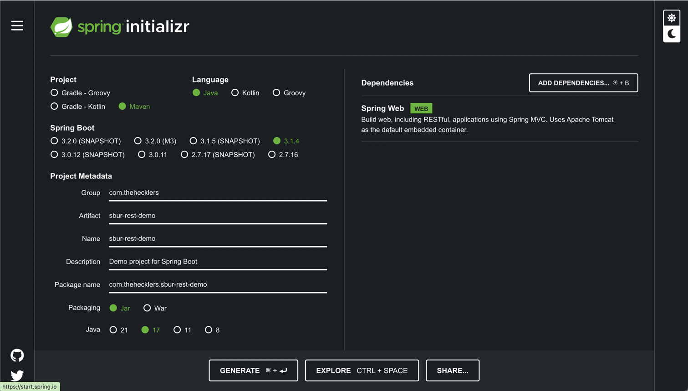
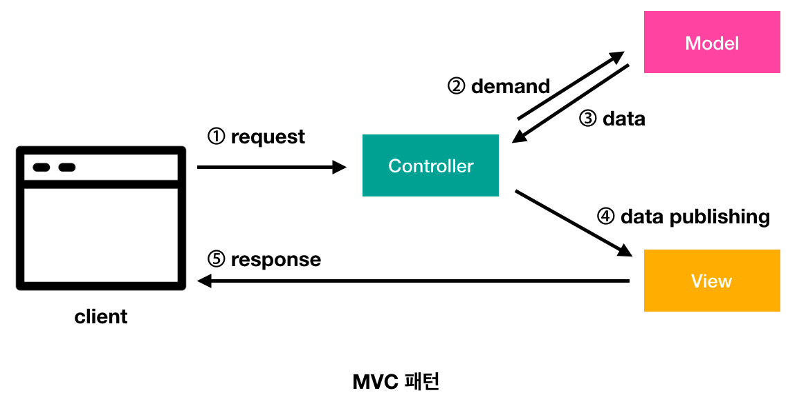

# Springboot

###  스프링 부트의 핵심 기능
- 의존성 관리(Dependency Management) 간소화 
- 배포(Deployment) 간소화
- 자동 설정(Auto Configuration)

# 1. 도구 선택 및 시작
## 1-1. Maven vs Gradle
자바 애플리케이션 빌드 도구 메이븐과 그레이들

### Maven
- XML 기반 설정: XML 기반의 설정파일('pom.xml') 을 사용한다. 프로젝트 구조가 규정되어 있어 빠른 설정이 가능하다.
- 설정의 간결성: 간단하고 명확한 설정을 통해 빠르게 프로젝트를 시작할 수 있다. 설정은 일반적으로 플러그인과 목표의 형태로 이루어져 있다.
- 제한된 프레임워크 확장성: 빌드 프로세스를 확장하기 위해 제한된 플러그인 아키텍처를 제공한다. 플러그인 개발이 단순하고 커뮤니티에서 사용 가능한 플러그인이 풍부하다.
- 의존성 관리: 중앙 Maven저장소에서 의존성을 관리한다. 의존성의 버전을 명시하면 Maven이 자동으로 다운로드 및 관리한다.

#### pom.xml
    <dependencies>
        <dependency>
            <groupId>org.springframework.boot</groupId>
            <artifactId>spring-boot-starter-web</artifactId>
        </dependency>
        <!-- 다른 필요한 의존성도 추가할 수 있다. -->
    </dependencies>

### Gradle
- Grooby 또는 Kotlin DSL 사용: Grooby 또는 Kotlin DSL 사용해서 좀 더 간결하고 표현력이 풍부한 스크릅트를 작성해서 설정할 수 있다.
- 높은 확장성: 강력하고 유연한 플러그인 아키텍처를 제공한다. 사용자가 직접 플러그인을 개발하거나 커스텀 태스크를 정의할 수 있다.
- 성능: 증분 빌드, 병렬 빌드 등의 기능을 통해 높은 성능을 제공한다. 빌드 스크립트가 복잡한 경우에도 효과적으로 처리할 수 있다.
- 멀티 프로젝트 빌드: 멀티 프로젝트 빌드를 지원하며, 여러 프로젝트 간의 의존성 관리가 용이하다. 각 프로젝트는 자체 빌드 스크립트를 가지며, 상위 프로젝트에서 하위 프로젝트로 참조할 수 있다.

#### build.gradle
    dependencies {
        implementation 'org.springframework.boot:spring-boot:spring-boot-starter-web'
        // 다른 필요한 의존성도 추가할 수 있다.
    }

#### Gradle Structure
       project  
        ├── gradle  
        │   └── wrapper  
        │       ├── gradle-wrapper.jar          // Wrapper 파일이다. 실행 스크립트가 동작하면 wrapper에 맞는 환경을 로컬 캐시에 다운로드 받은 뒤 실제 명령에 해당하는 task를 실행한다.
        │       └── gradle-wrapper.properties   // Gradle Wrapper 설정 파일  
        ├── gradlew                             // Unix에서 wrapper 실행 스크립트
        └── gradlew.bat                         // Wrapper를 빌드할 때 실행할 배치 스크립트

### 선택 기준
#### 프로젝트 구성
- Maven: 기본 구성을 사용하는 경우나 간단한 프로젝트에 적합
- Gradle: 복잡한 빌드 프로세스나 고도로 사용자 지정된 빌드 프로세스를 구축하는 데 적합
#### 언어 선호도
- Maven: XML을 사용하므로 XML에 익숙한 사용자에 적합
- Gradle: 그루비 또는 코틀린을 사용하므로 이 언어에 익순한 사용자에게 더 적합
#### 성능 및 확장성
- 성능 및 확장성이 중요한 경우 Gradle이 더 많은 기능과 유연성을 제공 (그러나 그 유연함 때문에 프로젝트가 예상대로 작동하지 않을 수 있다.)

 

## 1-2. 스프링 이니셜라이져
### [이니셜라이져](https://start.spring.io)
- Project: Gradle-Groovy
- Language: Java
- ProrjectMetadata
    - Group: 회사나 조직의 도메인 이름을 역순으로 (ex. com.company)
    - Artifact: 프로젝트의 아티팩트 ID 의미 (ex. user-service)
    - Name: 프로젝트 이름 표시 (ex.User Srivce)
    - Description: 프로젝트에 대한 간단한 설명 (Optional)
    - Package name: 프로젝트의 기본 패키지 이름으로 보통 Group ID 와 Artifiact ID 를 조합하여 자동으로 생성
    - Packaging: Jar
- Dependencies: 필요한 의존성 추가(Spring Boot DevTools, Spring Web, JPA 등)

 

## 1-3. 스프링 부트 CLI

### SDK 설치
    % curl -s "https://get.sdkman.io" | bash
    % source "$HOME/.sdkman/bin/sdkman-init.sh"

    % sdk version                      // 설치 확인
    % sdk list java                    // 설치할 수 있는 자바 목록 보기
    % sdk install java 11.0.19-amzn    // 리스트로 확인한 것 중 다운받을 버전 넣기
    % sdk use java 11.0.19-amzn        // 사용하기
    % sdk default java {사용하려는 버전}  // Java 디폴터 버전 설정
    % sdk current java                 // 현재 사용 버전 확인
    % echo $JAVA_HOME                  // 환경변수 자동 설정 확인

### 스프링 부트 프로젝트 시작하기

    % sdk install springboot           // 스프링 부트 설치
    % spring --version                 // 스프링 설치 확인 (설치 확인 안되면 터미널 재시작)
    % sdk use springboot (tap)         // 스프링 부트 사용

    % spring init                      // default 값으로 프로젝트 시작 
    % unzip demo.zip -d demo            

    % spring init -a demo -l java --build maven demo    // 설정 값으로 프로젝트 시작
        -a demo : 프로젝트의 아티팩트 ID 설정
        -l java : 프로젝트 기본 언어 (java, kotlin, groovy)
        --build : 빌드 시스템 (maven, gradle)
        -x demo : 이니셜라이저로 만든 프로젝트의 .zip 파일을 'demo' 디렉터리에 압축해제

        --target https://스프링 부트-프로젝트-생성에-사용할-url
####
    % spring init -a <artifactId> -g <groupId> -d <dependencies> -p <packaging> -v <version> --build <build-tool> -x <path>
- artifactId: projectName
- groupId: com.회사도메인
- dependencies: web/..
- packaging: jar
- version: 버전
- build-tool: maven/gradle
- path: 어떤 경로에서 압축 파일을 해제할 것인지 (이 옵션 안주면 zip 파일 생성)
#####
    % spring init -a kisa-gcs-java -g com.gaion -d web -p jar -v 1.0.0 --build gradle --type gradle-project -x .

### 빌드 도구 설치

    % brew install maven

    % sdk install gradle
    % sdk use gradle (tap)
    % gradle --vresion

### 프로젝트 실행

    % mvn spring-boot:run

    % ./gradlew bootRun

 

## 1-4. build.gradle

### dependencies - 의존성 추가
- build.gradle 파일의 dependencies 블록에 새로운 의존성 추가

            dependencies {
                // Spring Boot DevTools 사용: 개발 중 자동 재시작을 위해 DevTools 의존성 추가 가능
                developmentOnly 'org.springframework.boot:spring-boot-devtools'
            }
            
- 의존성 추가 후 프로젝트 재빌드

            gradle build
  
- 온라인에 원하는 의존성 검색 [Maven Repository](https://mvnrepository.com)

### dependencyManagement - 의존성 관리
- 의존성 버전을 중앙에서 관리할 수 있게 해주는 기능이다.
- 실제로 의존성을 프로젝트에 추가하지 않고, 버전만 정의한다.
- 하위 모듈이나 프로젝트에서 의존성을 사용할 때 버전을 명시하지 않아도 된다.
- 일고나된 버전 관리와 버전 충돌 방지에 도움이 된다.

### maveBom(Bill of Materials)
- 여러 관련 라이브러리의 버전을 한 번에 관리할 수 있게 해주는 특별한 POM(Project Object Model) 파일이다.
- imports 블록 내에서 사용되어 특정 기술 스택의 모든 관련 라이브러리 버전을 일괄적으로 가져온다.
- 특히 Spring Cloud 와 같이 여러 관련 프로젝트가 있는 경우 유용하다.
####
    ext {
    	set('springCloudVersion', "2023.0.0")
    }

    dependencyManagement {
        imports {
            mavenBom "org.springframework.cloud:spring-cloud-dependencies:${springCloudVersion}"
        }
    }
- ext: Gradle 의 Extra Properties 확장 기능을 사용한다는 의미이다.  
  이는 프로젝트 전체에서 사용할 수 있는 사용자 장의 속성을 정의할 수 있게 해준다.
- set('springCloudVersion', "2023.0.0"): 'springCloudVersion' 이라는 속성을 정의하고 값을 "2023.0.0" 로 설정한다.

 
 
 

# 2. REST API

### 2-1. 스프링 MVC를 사용한 애플리케이션 만들기

- Model: 데이터 담당
- View: 화면 담당
- Controller: 라우팅, 비즈니스 로직 담당

#### 간단한 도메인 만들기

    package com.gaion.kisadashboardjava;

    import org.springframework.boot.SpringApplication;
    import org.springframework.boot.autoconfigure.SpringBootApplication;
    import org.springframework.web.bind.annotation.RestController;
    import org.springframework.web.bind.annotation.RequestMapping;
    import org.springframework.web.bind.annotation.GetMapping;
    import org.springframework.beans.factory.annotation.Autowired;
    import org.springframework.stereotype.Service;
    import org.springframework.data.mongodb.core.MongoTemplate;
    
    import java.util.List;
    import java.util.ArrayList;
    
    @SpringBootApplication
    public class Application {
    
        public static void main(String[] args) {
            SpringApplication.run(Application.class, args);
        }
    }
    
    @RestController
    class HelloController {
    
        @Autowired
        private AiDroneService aiDroneService;
    
        @GetMapping("/")
        public String Hello()
        {
            return "Hello, World!";
        }
    
        @GetMapping("/api/realtime")
        public List<String> realtime() {
            List<String> distinctDroneIds = aiDroneService.getDistinctDroneIds();
            return distinctDroneIds;
        }
    }
    
    @Service
    class AiDroneService {
    
        private final MongoTemplate mongoTemplate;
    
        @Autowired
        public AiDroneService(MongoTemplate mongoTemplate) {
            this.mongoTemplate = mongoTemplate;
        }
    
        public List<String> getDistinctDroneIds() {
            List<String> distinctDroneIds = mongoTemplate.getCollection("ai_drone")
                    .distinct("device_id", String.class)
                    .into(new ArrayList<>());
    
            return distinctDroneIds;
        }
    }

 

### 빈(Bean)
스프링 컨테이너에서 관리되는 객체

### @SpringBootApplication
Spring Boot 애프리케이션의 주요 설정을 지정하는 메타 어노테이션이다. 이 어노테이션은 아래 3가지 어노테이션을 함께 포함하고 있다.
- **@Configuration**: 클래스가 Bean 구성 클래스임을 나타낸다. 이 이노테이션을 사용하여 클래스 내에서 @Bean 에노테이션을 사용하여 빈을 정의할 수 있다.

- **@EnableAutoConfiguration**: 스프링 부트의 자동 구성 기능을 활성화한다. 이 어노테이션을 사용하면 클래스 패스에 있는 의존성을 기반으로 자동으로 빈을 설정하고 설정 파일을 로딩한다.

- **@ComponentScan**: 스프링이 컴포넌트를 찾아 등록할 패키지를 지정한다. 이 어노테이션을 사용하지 않으면 @SpringBootApplication이 위치한 패키지부터 시작하여 하위 패키지의 컴포넌트만을 스캔한다.

이 3가지 어노테이션을 함께 사용하면 Spring Boot 애플리케이션을 간단하게 설정할 수 있다. 기본적인 구성, 자동 구성, 컴포넌트 스캔 모두 한 곳에서 처리되므로 애플리케이션의 설정이나 메타데이터를 최소화할 수 있다.

### @RestController
스프링 MVC 프레임워크에서 컨트롤러를 정의할 때 사용되는 어노테이션 중 하나이다. 이 어노테이션은 @Controller와 @ResponseBody를 합친 것으로 볼 수 있다.

일반적으로 Spring MVC에서는 @Controller 어노테이션을 사용하여 컨트롤러를 정의하고, 해당 메소드에서 반환되는 값은 View 이름으로 간주되어 View Resolver에 의해 처리된다. 그러나 @RestController를 사용하면 메소드의 반환 값이 View 이름이 아니라 HTTP 응답 본문으로 직접 전송된다.

간단히 말해 @RestController는 JSON 또는 XML 형식의 데이터를 반환하는 컨트롤러를 정의할 때 사용된다. 이는 주로 RESTful 웹 서비스에서 API 엔드포인트를 구현할 때 활용된다.

### @RequestMapping
스프링 MVC에서 컨트롤러 메서드에 요청한 URL을 매핑하기 위해 사용되는 어노테이션이다. 이 어노테이션을 사용하면 메소드가 어떤 URI에 응답할지를 지정할 수 있다.

@RequestMapping은 클래스 레벨과 메소드 레벨에서 모두 사용될 수 있다. 클래스 레벨에서 사용할 경우 해당 클래스의 모든 메소드에 대한 기본 URI를 설정하고, 메소드 레벨에서 사용할 경우 특정 메소드에 대한 URI를 설정한다.

    @RestController
    @RequestMapping("/api")
    public class MyRestController {
    
        // 기본 URI: /api/hello
        @GetMapping("/hello")
        public String hello() {
            return "Hello, World!";
        }
    
        // 기본 URI: /api/user
        @GetMapping("/user")
        public User getUser() {
            User user = new User("John Doe", "john@example.com");
            return user;
        }
    
        // 클래스 레벨에서 /greet이 추가됨
        @RequestMapping("/greet")
        public String greet() {
            return "Greetings!";
        }
    }

### @GetMapping / PostMapping / PutMapping / DeleteMapping
@GetMapping은 스프링 MVC에서 HTTP GET 요청을 처리하는 메소드에 부여되는 어노테이션이다. 주로 컨트롤러 메소드에서 특정 URI의 GET요청을 처리하기 위해 사용된다.

### @Service
스프링 프레임워크에서 서비스 계층의 구성요소를 나타낸다. 서비스 계층은 주로 비즈니스 로직을 처리하고 데터이 액세스, 트랜잭션 관리 등을 담당하는 부분이다. @Service 어노테이션인 이 서비스 빈을 정의하는 데 사용된다.
- 컴포넌트 스캔: @Service 어노테이션이 클래스에 지정되면, 해당 클래스는 Spring 컴포넌트 스캔에 의해 자동으로 빈으로 등록된다. 
- 의존성 주입: @Service 어노테이션이 지정된 클래스의 인스턴스는 다른 Spring 빈과 동일하게 의존성 주입을 받을 수 있다. 이를 통해 해당 서비스는 다른 서비스나 데이터 액세스 객체 등과 협력할 수 있다.
- 트랜잭션 관리: @Service 어노테이션을 사용하면 스프링의 트랜잭션 관리 서비스를 활용할 수 있다. 메소드에 @Transactional 어노테이션을 추가하여 트랜잭션을 설정할 수 있다.

즉 @Service 어노테이션을 사용하면 Spring에 의해 자동으로 빈으로 등록되며, 다른 컴포넌트에서 이 서비스를 주입받아 사용할 수 있게 된다.

### @Autowired
객체 간의 의존성을 자동으로 주입할 때 사용한다. 이 어노테이션은 필드, 생성자, 메서드에 적용할 수 있다.

생성자 주입은 보통 권장되는 방식이며, 필드나 메서드 주입보다 더 명확하고 안전한 방법으로 간주된다. 이를 통해 의존성을 놓치는 것을 방지하고 테스트 용이성을 높일 수 있다.

## 2-2. GET으로 조회하기
######
    @RestController
    class RestApiDemoController {
    private List<Coffee> coffees = new ArrayList<>();
    
        // 생성자를 만들어 객체 생성 시 커피 목록을 채우는 코드 추가
        public RestApiDemoController() {
            conffes.addAll(List.of(
                    new Coffee("Cafe Cereza"),
                    new Coffee("Cafe Ganador"),
                    new Coffee("Cafe Lareno"),
                    new Coffee("Coafe Tres pontas")
            ));
        }
    }

######
    @RestController
    class RestApiDemoController {
    private List<Coffee> coffees = new ArrayList<>();
    
        // RequestMapping을 사용한 GET 요청으로 커피 목록 가져오기
        @RequestMapping(value = "/coffees", method = RequestMethod.GET)
        // Iterable은 순회가능한 데이터 타입
        Iterable<Coffee> getCoffees() {
            return coffees;
        }
    }

######
    @RestController
    @RequestMaiing("/")
    class RestApiDemoController {
    private List<Coffee> coffees = new ArrayList<>();
    
        @GetMapping("/coffes")
        Iterable<Coffee> getCoffees() {
            return coffees;
        }
    }

### 특정 데이터 조회, get...ById
- 경로에 적혀있는 {id} 부분은 URL 변수이며, 해당 값은 @PathVariable이 달린 id 매개변수를 통해 getCoffeeById에 전달
- 일치하는 항목이 있으면 값이 있는 Optional<Coffee>를 반환하고, 없으면 비어있는 Optional<Coffee>를 반환
######
    @GetMapping("/coffees/{id}")
    Optional<Coffee> getCoffeeById(@PathVariable String id) {   
        for (Coffee c: offees) {
            if (c.getId().equals(id)) {
                return Optional.of(c);      // 자료형.of()는 불변하는 컬렉션 객체를 생성하는 메소드
            }
        }

        return Optinal.empty();
    }

 

## 2-3. POST로 생성하기
- 마샬링: 직렬화 과정, Java에서는 객체를 직렬화하여 바이트 스트림으로 변환하고 이를 파일로 저장하거나 네트워크를 통해 다른 시스템에 전송할 수 있습니다.
- 언마샬링: 마샬링된 데이터를 역직렬화 하는 과, 네트워크를 통해 수신한 직렬화된 데이터를 역직렬화하여 원래 객체로 복원할 때 사용됩니다.
######
    @PostMapping("/coffees")
    Coffee PostCoffee(@RequestBody Coffee coffee) {
        coffees.add(coffee);
        return coffee;
    }

 

## 2-4. PUT으로 수정하기
- 특정 식별자로 커피를 검색해서 찾으면 업데이트, 없으면 리소스 생성 
######
    @PutMapping("/coffees/{id}")
    Coffee putCoffee(@PathVariable String id, @RequestBody Coffee coffee) {
        int coffeeIndex = -1;
    
        for (Coffee c: coffees) {
            if (c.getId().equals(id)) {
                coffeeIndex = coffees.indexOf(c);
                coffees.set(coffeeIndex, coffee);
            }
        }
    
        return (coffeeIndex == -1) ? postCoffee(coffee) : coffee;
    }

 

## 2-5. DELETE로 삭제하기
- removeIf는 Predicate 값을 받아 목록에 제거할 커피가 존재하면 참을 반환하는 람다
######
    @DeleteMapping("/coffees/{id}")
    void deleteCoffee(@PathVariable String id) {
        coffees.removeIf(c -> c.getId().equals(id));
    }

 

## 2-6. 상태 코드
- GET 메서드에는 특정 상태 코드를 지정 X
- POST, DELETE 메서드에는 상태 코드 사용 권장
- PUT 메서드에는 응답 시 상태 코드 필수
######
    @PutMapping(/{id})
    ResponseEntity<Coffee> putCoffee(@PathVariable String id,
                                     @RequestBody Coffee coffee) {
        int coffeeIndex = -1;
    
        for (Coffee c: coffees) {
            if (c.getId().equals(id)) {
                coffeeIndex = coffees.indexOf(c);
                coffees.set(coffeeIndex, coffee);
            }
        }
    
        return (coffeeIndex == -1)
                ? new ResoponseEntity<>(postCoffee(coffee), HttpStatus.CREATED) 
                : new ResponsEntity<>(coffee, HttpStatus.OK);
    }

 

## 2-7. 검증하기

[HTTPie install](https://httpie.io/docs/cli/installation)

 
 
 

# 3. 데이터베이스 액세스
## 3-1. DB 엑세스를 위한 자동 설정 프라이밍

 

## 3-2. 앞으로 얻게 될 것

 

## 3-3. 데이터 저장과 조회

 

## 3-4. 추가적으로 다듬기

 
 
 

# 4. 애플리케이션 설정과 검사
## 4-1. 애프릴케이션 설정

 

## 4-2. 자동 설정 리포터

 

## 4-3. 액추에이터

 
 
 

# 5. 데이터 파고들기
## 5-1. 엔티티 정의

 

## 5-2. 템플릿 지운

 

## 5-3. 저장소 지원

 

## 5-4. @Before

 

## 5-5. 레디스로 템플릿 기반 서비스 생성하기

 

## 5-6. 템플릿에서 repository로 변환하기

 

## 5-7. JPA로 repository 기반 서비스 만들기

 

## 5-8. NoSQL 도큐먼트 데이터베이스를 사용해 repository 기반 서비스 만들기

 

## 5-9. NoSQL 그래프 데이터베이스를 사용해 repository 기반 서비스 만들기

 
 
 

# 6. 스프링 MVC로 만드는 애플리케이션
## 6-1. 스프링 MVC는 무엇을 의미할까?

 

## 6-2. 템플릿 엔진으로 사용자와 상호작용하기

 

## 6-3. 메시지 전달

 

## 6-4. 웹소켓으로 대화(Conversation) 생성하기

 
 
 

# 7. 프로젝트 리액터와 스프링 웹플럭스를 사용한 리액티브 프로그래밍
## 7-1. 리액티브 프로그래밍

 

## 7-2. 프로젝트 리액터

 

## 7-3. 톰캣 vs 네티

 

## 7-4. 리액티브 데이터 엑세스

 

## 7-5. 리액티브 Thymeleaf

 

## 7-6. 완전한 리액티브 프로세스 간 통신을 위한 RSocket

 
 
 

# 8. 프로덕션을 위한 애플리케이션 테스트
## 8-1. 단위 테스트

 

## 8-2. @SpringBootTest

 

## 8-3. 슬라이드 테스트

 
 
 

# 9. 애플리케이션 보안
## 9-1. 인증 및 인가 부여

 

## 9-2. 스프링 시큐리티 살펴보기

 

## 9-3. 스프링 시큐리티로 폼 기반 읹으 및 인가 구현

 

## 9-4. 인증 및 인가를 위한 OIDC와 OAuth2 구현

 
 
 

# 10. 애플리케이션 배포
## 10-1. 실행 가능한 JAR

 

## 10-2. JAR 확장

 

## 10-3. 컨테이너에 스프링 부트 애플리케잇녀 배포하기

 

## 10-4. 스프링 부트 애플리케이션 검사를 위한 유틸리티 컨테이너 이미지

 
 
 

# 11. 리액티브로 더 깊이 들어가기
## 11-1. 리액티브 언제 사용할까?

 

## 11-2. 리액티브 애플리케이션 테스트

 

## 11-3. 리액티브 애플리케이션 진단 및 디버깅
